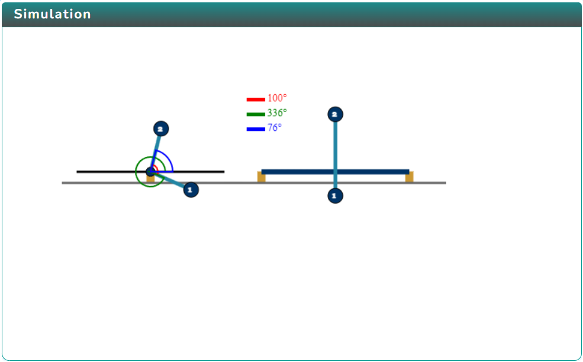
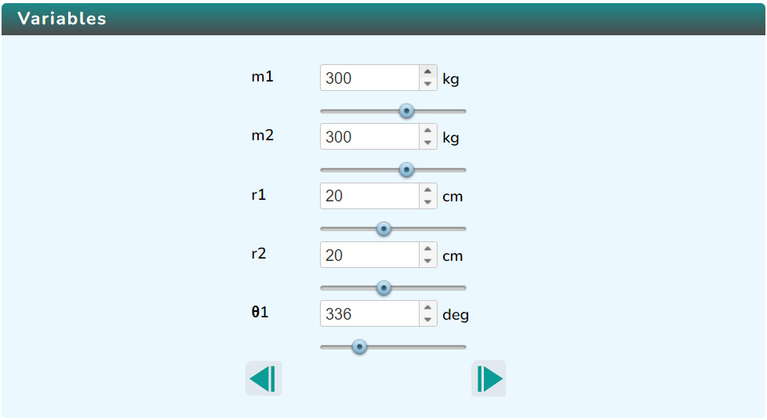
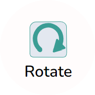

### Procedure

  Click on the Simulation icon      to view the simulation screen. 

   
   
   In order to view the variable section click on the Variable icon.  and to change the variables click on the Next  or Previous  button inside the variable section.

   

   Click on Play icon  to run the simulation and click on Pause icon  to stop it.

   Click on the Rotate icon  to change the direction of rotation.
   

