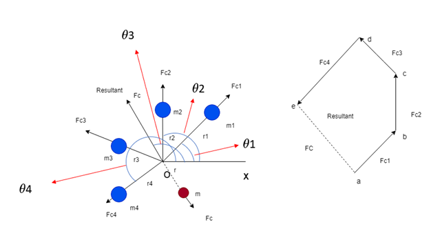
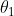
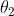
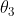
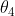
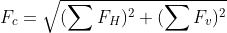
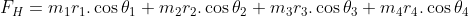
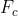
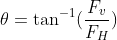

## INTRODUCTION 

#### Learning Objectives:

  1. Define the reasons for balancing of rotating mass
  2. State the conditions to be satisfied to achieve balance in rotating bodies.
  3. Calculate the mass and angular position required for balancing the unbalanced force.
  4. Analyse the analytical results with the simulation results
  5. Evaluate how change in mass and position can improve the balance of the rotating body

#### Theory
In most of the machineries, rotating components are very common. For any given rotating component, it is required that the centre of gravity coincide with the axis of rotation. However, this may not always the case due to various factors such as manufacturing defects, wear and tear, environmental conditions, addition of parts etc., and causing eccentricity. The eccentricity results in vibrations within the component and may finally cause failure. This eccentricity in the rotating component is considered to be unbalance in force and moment, and needs to be balanced by additional forces and moments leading to minimum vibration.<a href="references.html">[1]</a>

The balancing of rotating mass in single plane along the length of a shaft is a particular case of unbalance. An experiment is carried out to calculate additional mass required for balancing the unbalanced force and their angular position. The purpose of the experiment is to take an unbalanced system with rotating masses and adjust the radius of the outer mass, calculate the mass and angular position in order to achieve a balanced system.<a href="references.html">[1]</a>

Consider four masses of magnitude m1, m2, m3 and m4 at distance of r1, r2, r3 and r4 from the axis of the rotating shaft. Let , ,  and  be the angles of these masses with horizontal line ox, as shown in left hand side figure. Let these masses rotate about the axis through O and perpendicular to the plane of paper, with a constant angular velocity of  rad/sec.

The amount of balanced mass is the resultant of square root of sum of square of horizontal and vertical forces, which is acting in plane

So, the magnitude of resultant centrifugal force

The sum of horizontal component of centrifugal force

The sum of vertical component of centrifugal force

Resultant force vector  making inclination with horizontal, which is equals to 

  <a href="references.html">[1]</a>

The magnitude of balancing centrifugal force is equal to magnitude of resultant centrifugal force and direction is opposite to the resultant centrifugal force. 

(Equations Source: <a href="http://latex.codecogs.com/">latex.codecogs.com</a>)

