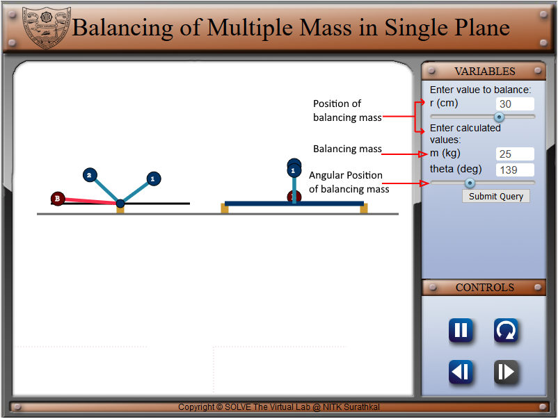

#### These procedure steps will be followed on the simulator

1. In simulation window top of two masses rotating on a shaft is displayed. 
2. There are pointers given on right side of the screen for choosing the values of input variables, viz., two unbalanced masses on the shaft (m1, m2), their radii of rotation (r1, r2) and relative angular position (theta1). After setting these variables, it is required to move on to the next pane by clicking on navigation button at the bottom right corner. 
 

3. After moving on to the next pane, the radius and positions of the balancing masses have to be entered by adjusting the slider. After setting the values, it is required by the user to calculate the values of balancing mass. 
 

4. Click on submit to submit the results and press play/pause button to pause the simulation. 
 

5. Compare analytically calculated results and the error in the result with the simulation results, displayed in the bottom of the simulator page. 
 
